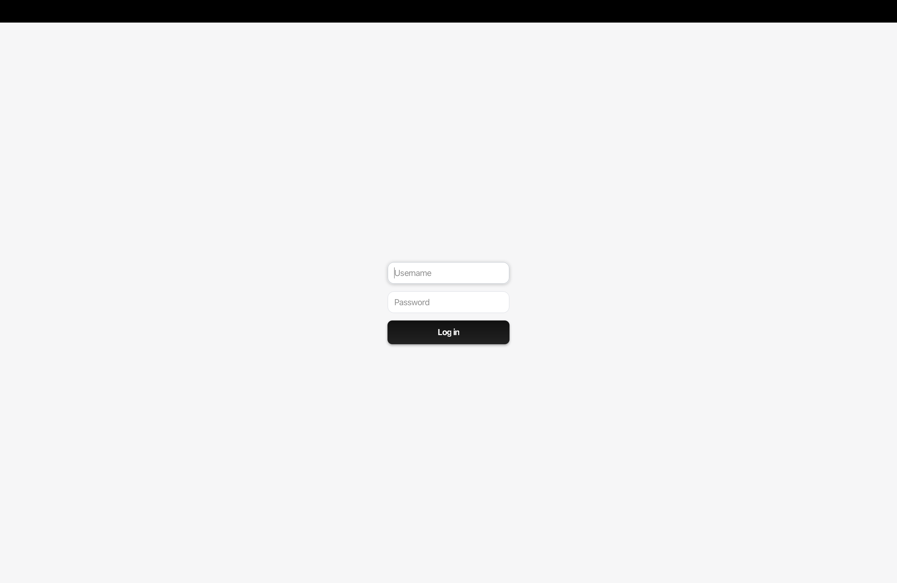

# Personal Budget System
A JavaFX desktop application for managing personal finances with dashboards, forms, and charts. Built in a component-based architecture and used Python/Pandas for data preparation.
___
## Motivation
As a person who works independently, I’ve always had the habit of tracking my finances. It began with a simple Google Sheets table then expanded to a full SQL database paired with Google Looker for visualization and a custom JavaScript web form to insert new records. This setup, however, had limitations:

* The web form only allowed data insertion. It didn’t support updating, deleting, or reading data.
* Google Looker had limits that prevented me from creating some custom charts I needed, such as monthly balance growth over a certain number of months.
* I had to view the data from one place and insert from another place which was bothersome.
* The data was plain open for anyone who enters my laptop to see or edit as there was no login page.

This university project came up at the right time. It gave me a reason to build the system, and so came the 2-in-1 solution: a system that satisfies the project requirements and serves as my own personal budgeting system.

I used Google Looker’s dashboards as inspiration for my UI design but also tried to implement best practices in UI conventions and user experience, taking into consideration good design layout, good user journey, and ease of use.

To make sure it works on my database, I generated mock data that mimics my actual database data, preparing and cleaning it with Python, NumPy, and Pandas then seeding it into SQLite. After submission, I plan to connect the application to my database and use it as my personal budgeting system.

This project is fully functional, not just a prototype, designed to address the limitations of my previous system.

### Summary
* Used SQL + Google Looker + insert-only custom JS web form.
* Hit limits: No CRUD operations, Google Looker chart constraints, insert from one place, view from another, no login page.
* University project came at the right timing.
* Built a 2-in-1 solution: A JavaFX desktop app with login page, full CRUD, and custom dashboards, seeded with mock data prepared via Python/NumPy/Pandas and stored in SQLite.
___
## Features
* **Authentication**: Login page with validation and error handling.
* **Dashboards**: Income, Receivables, Savings, Investments, Payables, Bills.
* **View/Edit Modes**: Switch between dashboards and forms.
* **Forms**: Smart state-changing CRUD user interface with validation and CRUD flows.
* **Settings**: Change name, username, password, full validation.
* **Data Handling**: SQLite embedded DB, seeded with prepared mock data.
* **Minimal UI**: Design inspired by Google Looker following UI/UX best practices.
___
## Architecture & Tech Stack
* **Language & Frameworks**: Java, JavaFX.
* **Database**: SQLite (embedded with seed data).
* **Structure**: Component-based (React-style structure).
* **Testing**: SchemaLoader, DAO testers, DatabaseTester.
* **Data Preparation**: Python, NumPy, Pandas for preparing and cleaning web-generated mock data.
* **Design Patterns**: Abstract classes for reusability, enums for different states such as modes/views.
___
## Screenshots
### Login Page

### Dashboards

### Forms

___
## How to Run
### Requirements
* Git
* Java 17+
* JavaFX SDK installed and configured in your IDE
* IntelliJ IDEA (recommended)

SQLite is already embedded in the project, so no setup is required.
### Setup
`git clone https://github.com/yazeedmomani/uni-project_personal-budget.git`
1.	Open the project in IntelliJ IDEA.
2.	Make sure JavaFX SDK is configured.
3.	Run Main.java to start the application.

**Note**: If you’re new to JavaFX setup, check the [official guide](https://openjfx.io/openjfx-docs/) for instructions on configuring it in IntelliJ.
### Login
There are two users. Login with one of them:
1. **Yazeed**
   * username: admin
   * password: 123456
2. **Bara**
   * username: bara
   * password: bara123
___
## What I Learned
* **Importance of Templating**: Writing abstract classes for recurring code has saved me an incredible amount of time when creating views, debugging, or changing something.
* **Importance of Writing Clean Code**: Taking the time to write clean code and organize files using component-based architecture was definitely worth it. Many times I forgot what I wrote and having organized code helped a lot.
* **Importance of Separating Logic**: Separating logic such as validation into their own classes has helped a lot when it comes to reusability and preventing future bugs. Especially in validation where you have to consider different scenarios for every input.
* **Importance of Code Abstraction**: Code pieces like ones that create charts and tables were difficult to mess with and make changes to. Separating them to their own classes with parameterized constructors has helped a lot in creating different charts. I did the same with creating forms and dashboards.
* **Importance of Testers**: Creating tester classes has saved me a lot of time. Especially after making changes to the database, running testers would usually hit error. I always realized the errors early before it became costly.
* **Importance of Documenting in Data Preparation**: I ran through multiple bugs and typos in the data seed which forced me to change the data and go through the data preparation process again. Documenting my steps saved me a lot of time and trouble.
* **Practiced Python and Pandas**: Preparing the data seed has allowed me to practice and better understand Python and especially Pandas.
___
## Future Improvement Ideas
* **Next Bill Card**: Add a card in the Monthly Bills section showing next bill/s and the cost in JOD.
* **Annual Bills**: Make Monthly Bills section support annual bills and other recurring bills.
* **Google Calendar Integration**: This is probably a hard one, but I'd like to integrate monthly bills with Google Calendar.
* **Monthly Report**: Generate monthly report and send it by email.
* **Make It Downloadable**: Package it to .exe and .dmg to make it downloadable on Mac and Windows.
___
## License

This project is for educational and personal portfolio use only.  
Unauthorized copying, modification, or commercial use of this project’s code and files is not permitted without explicit permission from the author.  